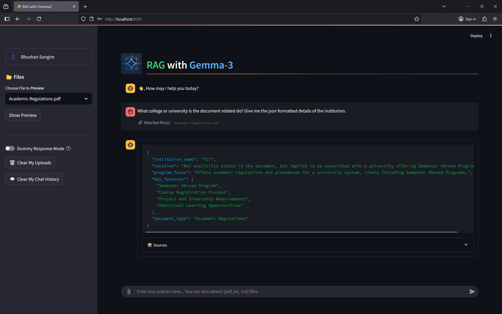
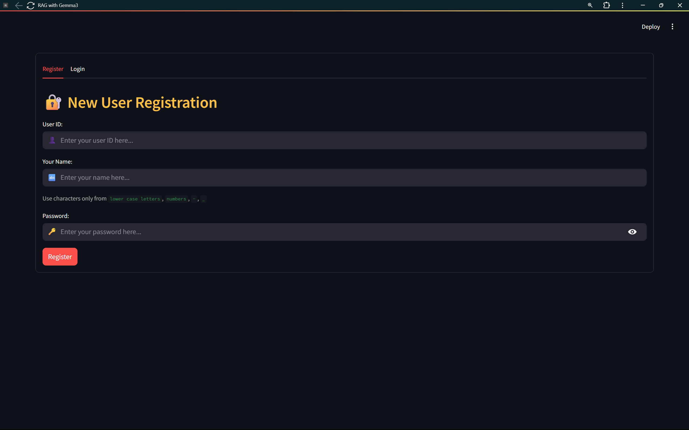
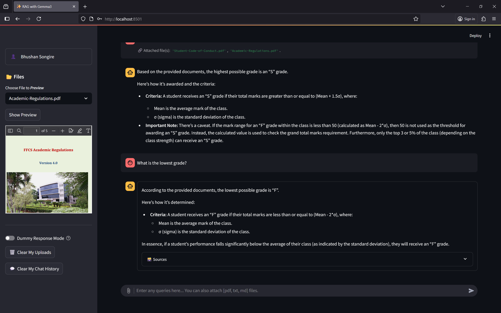
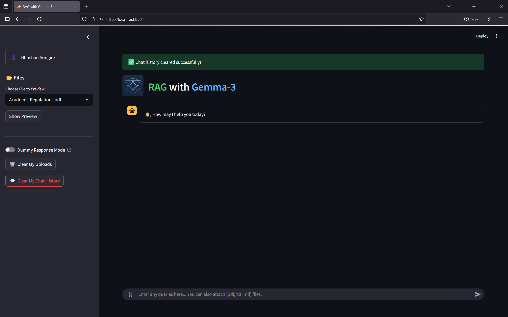
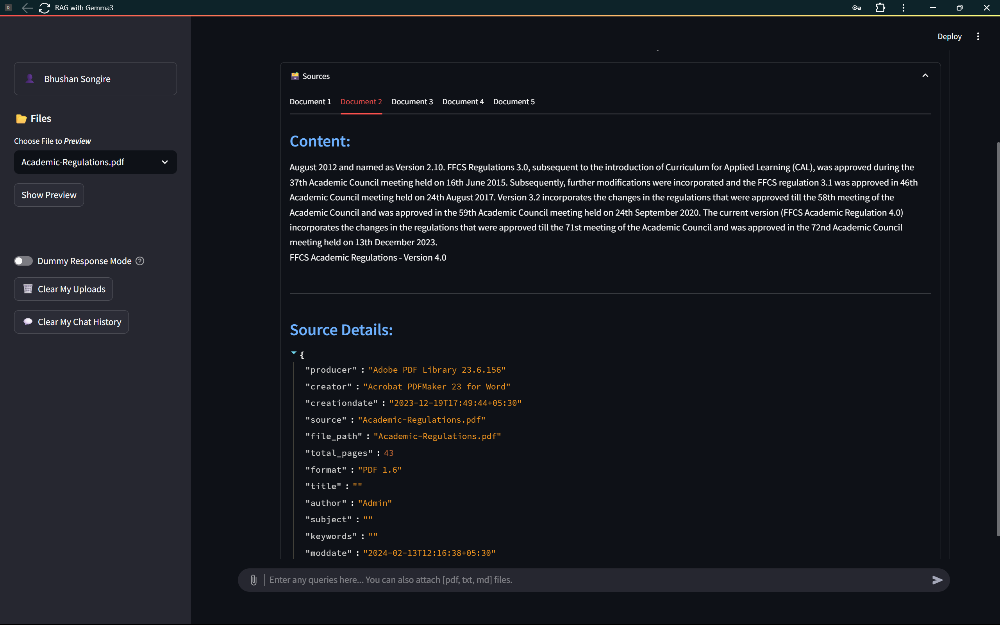
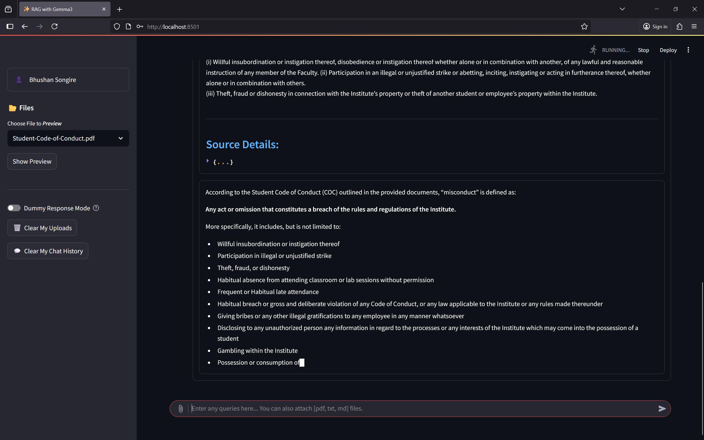

# `RAG with Gemma-3`

This project is a **modular Retrieval-Augmented Generation (RAG) system** built with Google DeepMind's - **Gemma 3** served locally using Ollama. It allows users to upload documents (PDF, TXT, Markdown etc.), and then chat with the content using natural language queries - all processed through a local setup for privacy and full control.

Designed with modularity and performance in mind, the system handles end-to-end workflows including file ingestion, vector embedding, history summarization, document retrieval, context-aware response generation, and streaming replies to a frontend. It supports multi-file embeddings per user, persistent session history and document storage, and offers live document previews - making it complete end-to-end RAG pipeline useful for educational, or personal assistants.

<!-- Check out the project deployment on [Hugging Face Spaces](https://huggingface.co/spaces/bhushan-songire/rag-with-gemma3) for a live demo. -->
Check out the live project deployment: [](https://huggingface.co/spaces/bhushan-songire/rag-with-gemma3)


# 📃 Index:
- [RAG with Gemma-3](#rag-with-gemma-3)
- [Project Details](#-project-details)
    - [Aim](#aim)
    - [Methodology](#methodology)
    - [Features](#features)
- [Tech Stack](#-tech-stack)
- [Installation](#%EF%B8%8F-installation)
    - [Virtual Environment](#virtual-environment)
    - [Docker](#-docker)
        1. [Development](#development)
        1. [Deployment](#deployment)
- [Extra Measures](#%EF%B8%8F-extra-measures)
    - [Mount Storage](#mount-storage)
    - [Removing all the cache files](#removing-all-the-cache-files)
    - [Using Host Machine's Ollama on Linux](#using-host-machines-ollama-on-linux)
    - [Ollama Models](#ollama-models) 
- [Future Work](#-future-work)
- [Contributions](#-contributions)
- [License](#-license)
- [Contact](#-contact)


# 🎯 Project Details:
## Aim
The core objective of this project is to build a **robust RAG system** with modern components and clean modular design and proper error handling.

## Methodology
1. Make a responsive UI in `Streamlit` allowing user to upload documents, get previews to ensure correctness and interact with them.
1. Use `FastAPI` to build a backend that handles file uploads, document processing, user authentication and streaming LLM responses.
1. Code modular `LLM System` using `LangChain` components for chains, embeddings, retrievers, vector storage, history management, output parsers and overall LLM-Orchestration.
1. Integrate locally hosted `Gemma-3` LLM using `Ollama` for local inference.
1. Use `FAISS` for efficient vector storage, similarity search and user specific document storage and retrieval.
1. Use `SQLite-3` for user management, authentication, and data control.
1. Create a dynamic `Docker` setup for easy deployment as either a development or deployment environment.
1. Deploy project on `Hugging Face Spaces` for easy access and demonstration.

> [!Note]  
> Due to hosting limitations of Gemma3, the Hugging Face Space deployment uses `Google Gemini-2.0-Flash-Lite` as the LLM backend.


## RAG Samples:

- Q: Highest possible grade:
    [](./Docs/5_Doc_Retr_Que.png)
    [](./Docs/5_Doc_Retr_Ans.png)
- Q: Formatted Output:
    [](./Docs/2.3_Sample_Ans.png)

## Features

- User Authentication:
    + Authenticate users using `SQLite-3` database and `bcrypt` based password hashing and salt.
        [](./Docs/1_Auth.png)
    + Store user data securely and also auto clear stale sessions data.

- UI and User Controls:
    + Build a responsive UI using `Streamlit` app. Provide a chat interface for users to ask questions about their documents, get file previews and receive context-aware responses.
        [](./Docs/2.2_Preview.png)
    + User uploaded files and corresponding data are tracked in a **SQLite-3** database.
    + Allow users to delete their uploaded documents, and manage their session history.
        [](./Docs/3_Clear_Chat_Hist.png)
    + Note: Files previews are cached for 10 minutes, so even after deletion, the file preview might be available for that duration. 
    + Also works with FastAPI SSE to show real-time responses from the LLM and retrieved documents and metadata for verification.
        [](./Docs/7_Metadata_n_Src.png)


- User wise document management:
    + Support **multi-file embeddings** per user, allowing users to upload multiple documents and retrieve relevant information based on their queries.
    + Some documents can also be added as ***public*** documents, which can be accessed by all users. (like shared rulebooks or manuals or documentation)

- Embeddings, Vector Storage and Retrieval:
    + Implement **vector embeddings** using `LangChain` components to convert documents into vector representations.
    + Open source `mxbai-embed-large` model is used for generating embeddings, which is a lightweight and efficient embedding model.
    + Use `FAISS` for efficient vector storage and retrieval of user-specific + public documents.
    + Integrate **similarity search** and document retrieval with Gemma-based LLM responses.

- FastAPI Backend:
    + Build a **FastAPI** backend to handle file uploads, document processing, user authentication, and streaming LLM responses.
    + Integrate with 'LLM System' module to handle LLM tasks.
    + Provide status updates to UI for long running tasks:
        [](./Docs/5_Doc_Retr_Que.png)
    + Implement **Server-Sent Events (`SSE`)** for real-time streaming of LLM responses to the frontend with ***NDJSON*** format for data transfer.
        [](./Docs/6_Streaming_Resp.png)
    + Provide UI with retrieved documents and metadata for verification of responses.

- LLM System:
    + Modular `LLM System` using `LangChain` components for:
        1. **Document Ingestion**: Load files and process them into document chunks.
        1. **Vector Embedding**: Convert documents into vector representations.
        1. **History Summarization**: Summarize user session history for querying vector embeddings and retrieving relevant documents.
        1. **Document Retrieval**: Fetch relevant documents based on standalone query and user's metadata filters.
        1. **History Management**: Maintain session history for context-aware interactions.
        1. **Response Generation**: Generate context-aware responses using the LLM.
        1. **Tracing**: Enable tracing of LLM interactions using `LangSmith` for debugging and monitoring LLM interactions.
        1. **Models**: Use `Ollama` to run the **Gemma-3** LLM and **mxbai embeddings** locally for inference, ensuring low latency and privacy.

- Dockerization:
    + Create a dynamic `Docker` setup for easy deployment as either a development or deployment environment.
    + Use [`Dockerfile`](./Dockerfile) to manage both [FastAPI](./server/server.py) and [Streamlit](./app.py) server in a single container (mainly due to Hugging Face Spaces limitations).


# 🧑‍💻 Tech Stack
- 🦜️ LangChain
- ⚡ FastAPI
- 👑 Streamlit
- 🐋 Docker
- 🦙 Ollama
    - Gemma-3
    - mxbai-embed-large
- ♾️ FAISS
- 🪶 SQLite-3
- 🛠️ LangSmith
- 🔐 bcrypt

Others:
- 🤗 **Hugging Face Spaces**: 
    + Deploy the project in a Docker container using Dockerfile.
- :octocat: **GitHub actions and Branch Protection**: 
    + Process the repository for auto deployment to Hugging Face Spaces.
    + Check for any secret leaks in code.
    + Fail the commit on any secret leaks.


# 🛠️ Installation
There are two ways to run this project - either directly using a [**Virtual Environment**](#virtual-environment) or using [**Dockerfile**](#-docker).

## Virtual Environment

1. Clone the repository:
    ```bash
    git clone --depth 1 https://github.com/Bbs1412/rag-with-gemma3.git
    ```

1. Create virtual environment  and install dependencies:
    ```bash
    # Create environment:
    python -m venv venv
    
    # Activate environment:
    source venv/bin/activate  # On Linux/Mac
    # or
    venv\Scripts\activate  # On Windows

    # Install dependencies:
    pip install -r requirements.txt
    ```

1. (Optional) If you want to use LangSmith tracing, create a `.env` file in the `server` directory and add these credentials:
    ```ini
    # ./server/.env
    LANGCHAIN_TRACING_V2=true
    LANGCHAIN_ENDPOINT="https://api.smith.langchain.com"
    LANGCHAIN_API_KEY="<paste_your_api_key_here>"
    LANGCHAIN_PROJECT="rag-with-gemma3"
    ```

1. Start the FastAPI server:
    ```bash
    cd server
    uvicorn server:app
    # For development with hot-reloading
    # uvicorn server:app --reload --port 8000
    ```

1. Start the Streamlit server:
    ```bash
    cd ..
    streamlit run app.py
    ```

1. You can now access these servers:
    - FastAPI backend at [http://localhost:8000](http://localhost:8000)
    - Streamlit frontend at [http://localhost:8501](http://localhost:8501)
    - FastAPI Swagger UI at [http://localhost:8000/docs](http://localhost:8000/docs)
    

## 🐋 Docker
Dockerfile is coded dynamically to support both development and deployment environments.

1. Development:
    - Project uses `http://host.docker.internal:11434` as the Ollama server for local inference.
    - This is to ensure that existing Ollama models in the host machine are accessible from the docker container.
    - In this env, all three ports {8000:FastAPI, 8501:Streamlit, 11434:Ollama} are exposed for easy access.
1. Deployment:
    - Project uses Google `Gemini-2.0-Flash-Lite` as the LLM and `text-embedding-004` as embedding model.
    - Primarily due to deployment and API limitations of Gemma3 model.
    - In this env, only port 7860 is exposed for the Streamlit frontend.

### `Development:`
1. Build the Docker image:
    ```bash
    docker build -t BBS/rag-with-gemma3:dev --build-arg ENV_TYPE=dev .
    ```

1. Create a Docker container:
    ```bash
    docker create --name rag-gemma-cont-dev \ 
        -e ENV_TYPE=dev \
        # Below 4 are optional env-vars for LangSmith tracing \
        -e LANGCHAIN_TRACING_V2=true \
        -e LANGCHAIN_ENDPOINT="https://api.smith.langchain.com" \
        -e LANGCHAIN_API_KEY="<paste_your_api_key_here>" \
        -e LANGCHAIN_PROJECT="rag-with-gemma3" \
        # Port mapping for FastAPI, Streamlit, and Ollama \
        -p 8000:8000 -p 8501:8501 -p 11434:11434 \
        BBS/rag-with-gemma3:dev
    ```

1. Start the Docker container:
    ```bash
    docker start -a rag-gemma-cont-dev
    ```

1. You can now access these servers:
    - FastAPI backend at [http://localhost:8000](http://localhost:8000)
    - Streamlit frontend at [http://localhost:8501](http://localhost:8501)

### `Deployment:`
1. Build the Docker image:
    ```bash
    docker build -t BBS/rag-with-gemma3:prod --build-arg ENV_TYPE=deploy .
    ```

1. Create a Docker container:
    ```bash
    docker create --name rag-gemma-cont-prod \
        -e ENV_TYPE=deploy \
        # Below 4 are optional env-vars for LangSmith tracing \
        -e LANGCHAIN_TRACING_V2=true \
        -e LANGCHAIN_ENDPOINT="https://api.smith.langchain.com" \
        -e LANGCHAIN_API_KEY="<paste_your_api_key_here>" \
        -e LANGCHAIN_PROJECT=deployed-rag-gemma3 \
        # This is necessary env variable \
        -e GOOGLE_API_KEY="<paste_your_google_api_key_here>" \
        # Port mapping, only 7860 is exposed \
        -p 7860:7860 \
        BBS/rag-with-gemma3:prod
    ```

1. Start the Docker container:
    ```bash
    docker start -a rag-gemma-cont-prod
    ```

1. You can now access the Project at [http://localhost:7860](http://localhost:7860)


# 🛡️ Extra Measures

## Mount Storage:
- To ensure that user data is persistent and not lost when the container is stopped or removed, you can mount a local directory to the container's storage directory.
- You can do this by adding the `-v` flag to the `docker create` command:
-   ```bash
    docker create --name rag-gemma-cont-dev \
        -e ENV_TYPE=dev \
        -v /path/to/local/storage:/app/storage \
        # Other flags...
    ```

## Removing all the cache files:
- Linux:
    ```bash
    find . -type d -name "__pycache__" -exec rm -r {} +
    ```
- Windows:
    ```powershell
    Get-ChildItem -Recurse -Directory -Filter "__pycache__" | Remove-Item -Recurse -Force
    ```

## Using Linux Host Machine's Ollama on container:
- The Ollama server is configured to run on `http://host.docker.internal:11434` by default, which works out-of-the-box on Windows and macOS.
- On Linux, Docker does not support ***host.docker.internal*** automatically.
- To fix this, add the following flag in the docker create command:
    ```bash
    --add-host=host.docker.internal:host-gateway
    ```


## Ollama Models:
- To change LLM or Embedding model:
    + Go to [`./server/llm_system/config.py`](./server/llm_system/config.py) file.
    + It is central configuration file for the project.
    + Any constant can be changed there to be used in the project.
    + There are two diff models saved in config, but, I have used same model for response generation and summarization, if you want to change it, you can update the summarization model in `server.py` (≈ line 63)

- To change inference device:
    + I have configured the LLM model to work on GPU and embedding model to work on CPU. 
    - If you want to use GPU for embeddings too, you can change the **num_gpu** parameter in [`./server/llm_system/core/database.py`](./server/llm_system/core/database.py) (≈ line 58).
    + 0 means 100% CPU, -1 means 100% GPU, and any other number specifies particular number of model's layers to be offloaded on GPU. 
    + Delete this parameter if you are unsure of these values and your hardware capabilities. Ollama dynamically offloads layers to GPU based on available resources.

> [!Note]  
> If you are using docker, make sure to do these changes in [`./docker/dev_*`](./docker/) files.


# 🚀 Future Work
- Add support for more file formats like DOCX, PPTX, etc.
- Add web based loading so that any website can be loaded and queried on the go.
- Create docker-compose setup for easier management of multiple containers.


# 🤝 Contributions 
Any contributions or suggestions are welcome!

# 📜 License
[](https://www.gnu.org/licenses/gpl-3.0)
- This project is licensed under the `GNU General Public License v3.0`
- See the [LICENSE](LICENSE) file for details.
- You can use the code with proper credits to the author.

# 📧 Contact
- **Email -** [bhushanbsongire@gmail.com](mailto:bhushanbsongire@gmail.com)
